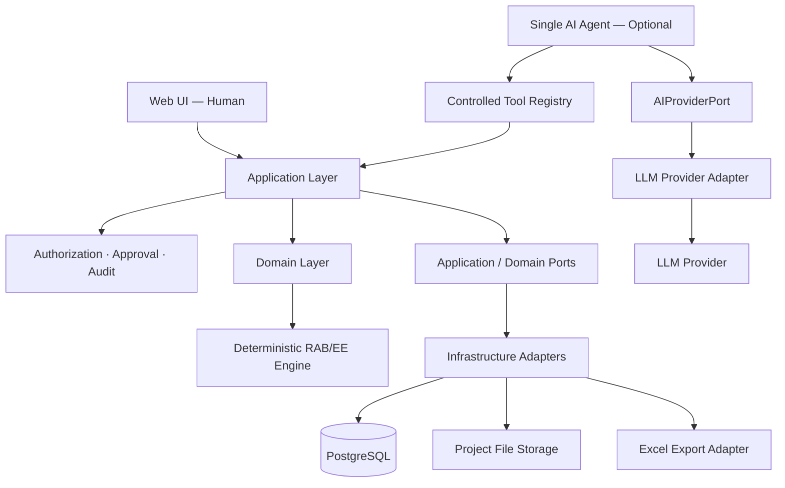

# 08 — Architecture Foundation

**Project:** Consultant AI Office  
**Scope:** Phase 0 — AI Office Foundation dan Phase 1 — RAB / Engineer's Estimate Engine  
**Status:** **ACCEPTED — ARCHITECTURE FOUNDATION BASELINE**  
**Deployment direction:** Local-first, server-ready  
**Revision:** 2026-08-28 — final Manager Acceptance; audit A-001 s.d. A-011 dan minimum architecture patches diterima; acceptance dicatat pada Decision Log D-025  

## 1. Tujuan dan Kedudukan Dokumen

Dokumen ini menetapkan fondasi teknis Consultant AI Office yang dibangun secara bertahap tanpa menjadikan AI sebagai pusat business logic.

Dokumen ini:

- menjelaskan boundary Web UI, Application Layer, Domain Layer, Infrastructure, dan AI Agent Layer;
- menetapkan arah local-first web application dan modular monolith;
- memastikan manusia dan AI memakai use case serta business logic yang sama;
- membatasi akses dan kewenangan AI;
- memisahkan arsitektur yang disiapkan sekarang dari feature/infrastructure yang benar-benar dibangun pada Phase 1;
- mengikat technical blueprint berikutnya kepada Decision Log D-001 s.d. D-024 dan kontrak final Jalur A/B/C.

Dokumen ini tidak menggantikan Decision Log dan tidak menetapkan ulang aturan bisnis RAB/EE. Untuk Phase 1, Decision Log D-001 s.d. D-024 adalah authority keputusan produk/business rule yang berlaku.

Jalur A, B, dan C telah melalui rekonsiliasi dan integration gate telah ditutup. Karena itu:

- `10-ahsp-normalization-spec.md` diperlakukan sebagai **FINAL AS MASTER-DATA CONTRACT**;
- `11-golden-test-spec.md` diperlakukan sebagai **FINAL AS GOLDEN TEST CONTRACT**;
- `12-excel-output-contract.md` diperlakukan sebagai **FINAL FOR IMPLEMENTATION**;
- ketiganya bukan lagi open design input yang boleh ditafsirkan ulang diam-diam oleh technical blueprint.

Jika technical blueprint atau implementasi menemukan konflik baru terhadap Decision Log atau kontrak final A/B/C, implementasi tidak boleh memilih asumsi sendiri. Konflik dikembalikan ke Manager Decision.

Urutan otoritas dokumen:

```text
Decision Log D-001 s.d. D-024
        ↓
Kontrak final Jalur A / B / C
        ↓
Baseline RAB/EE yang masih relevan
        ↓
Architecture Foundation yang telah disetujui
        ↓
Technical blueprint dan implementasi
```

Jika baseline lama berhenti pada D-022, Decision Log D-023/D-024 tetap memiliki precedence.

---

## 2. Keputusan Arsitektur yang Disetujui

Seluruh butir A-001 sampai A-011 telah diaudit terhadap Decision Log D-001 s.d. D-024 dan kontrak final Jalur A/B/C. Tidak ditemukan konflik yang mengharuskan keputusan arsitektur utama dibatalkan atau didesain ulang.

Seluruh butir A-001 sampai A-011 berstatus `ACCEPTED` berdasarkan Manager Acceptance tanggal 2026-08-28 dan pencatatan pada Decision Log D-025.

### A-001 — Browser-Based Local Application

Consultant AI Office dibuat sebagai web application yang pada tahap awal dijalankan pada satu komputer utama dan diakses melalui browser menggunakan alamat lokal.

```text
Browser
  ↓
http://localhost
  ↓
Consultant AI Office
  ↓
PostgreSQL lokal + project file storage
```

Alasan:

- penggunaan awal hanya oleh satu operator;
- tidak memerlukan deployment publik pada tahap validasi;
- UI dan backend dapat dipindahkan ke server tanpa mengganti model aplikasi;
- lebih sederhana daripada menjadikan Electron sebagai core application.

Electron atau desktop wrapper dapat dipertimbangkan kelak sebagai lapisan distribusi, tetapi bukan fondasi arsitektur.

### A-002 — Local-First, Server-Ready

Perbedaan deployment lokal dan server hanya pada konfigurasi dan adapter infrastruktur, bukan pada business logic.

| Komponen | Tahap awal: komputer utama | Tahap berikutnya: server |
| --- | --- | --- |
| UI | Browser pada komputer utama | Browser dari perangkat berizin |
| Application server | Proses atau container lokal | Proses/container pada server |
| Database | Satu PostgreSQL lokal | Satu PostgreSQL server/managed |
| File storage | Folder proyek melalui storage adapter | Object storage/MinIO/S3-compatible adapter |
| Akses | `localhost` | Domain/VPN/private network |
| Keamanan jaringan | Tidak diekspos ke internet | TLS, firewall, authentication, authorization, backup |

### A-003 — Modular Monolith

Phase 0–1 menggunakan satu aplikasi modular, bukan microservices dan bukan multi-agent system.

Modul dipisahkan secara logis agar dapat diuji sendiri, tetapi dijalankan dan di-deploy sebagai satu sistem.

```text
User Interface / AI Tools
          ↓
    Application Layer
          ↓
      Domain Layer
          ↓
       Ports
          ↓
Infrastructure Adapters
```

Alasan:

- lebih mudah dijalankan oleh satu operator;
- transaksi, approval, dan audit lebih sederhana;
- deployment lokal lebih ringan;
- boundary tetap tersedia jika kelak satu modul benar-benar perlu dipisahkan.

### A-004 — Deterministic RAB/EE Boundary

Semua perhitungan numerik kritis berada pada deterministic RAB/EE Engine di Domain Layer.

AI hanya boleh:

- memahami intent;
- mencari kandidat AHSP atau data proyek;
- meminta klarifikasi;
- memanggil controlled tool;
- menjelaskan hasil yang dikembalikan sistem;
- mendeteksi data hilang atau tidak lazim untuk diperiksa manusia.

AI tidak boleh:

- menjadi source of truth;
- membuat formula RAB di dalam prompt atau skill sebagai aturan sistem;
- menetapkan angka final berdasarkan jawaban LLM;
- mengubah hasil deterministic engine tanpa melalui use case yang sah.

RAB/EE Engine wajib tetap dapat digunakan melalui Web UI ketika AI atau LLM Provider tidak tersedia.

**BV execution boundary Phase 1:**

- BV hanya menjalankan registered/controlled calculation templates;
- template direferensikan melalui semantic key + version yang stabil;
- free-form executable formula, arbitrary expression engine, dan formula yang bergantung pada posisi baris bukan bagian dari core Phase 1;
- formula display boleh disediakan untuk audit, tetapi bukan executable source of truth.

### A-005 — Shared Application Boundary

Manusia dan AI menggunakan Application Layer dan Domain Layer yang sama.

```text
MANUSIA                         AI
Web UI                          Single Agent
   ↓                                ↓
Application Use Case       Controlled Tool Registry
   ↓                                ↓
   └────────── Application Use Case ┘
                     ↓
            Deterministic RAB Engine
```

Konsekuensi:

- business rule tidak boleh diduplikasi di UI, tool AI, prompt, atau skill;
- UI tidak menulis langsung ke database;
- tool AI merupakan adapter terhadap application use case, bukan implementation path kedua;
- validasi, permission, transaction, revision, dan audit berlaku konsisten untuk actor manusia maupun AI.

### A-006 — Optional Single Agent Orchestrator

AI Agent Layer merupakan kemampuan opsional di dalam Consultant AI Office, bukan pengganti core application.

Phase 1, jika AI diaktifkan, hanya memakai satu agent utama dengan pola request-response. Agent tersebut mengorkestrasi tool, tetapi tidak menjalankan worker otonom, subagent, scheduler, atau proses background persisten.

Kegagalan LLM Provider tidak boleh menghambat:

- pencarian data melalui UI;
- input dan review RAB;
- deterministic calculation;
- validasi;
- versioning;
- pembuatan keluaran Excel.

### A-007 — Controlled Tool Registry

AI hanya boleh melakukan operasi melalui tool/API yang didefinisikan, divalidasi, diberi permission, dan diaudit.

Contoh tool konseptual:

```text
get_project()
search_ahsp()
get_harga_dasar()
calculate_rab_preview()
create_rab_draft()
validate_rab()
export_rab()
```

AI tidak memperoleh:

- koneksi database;
- SQL bebas;
- akses terminal bebas;
- akses filesystem bebas;
- kemampuan melewati approval policy;
- kemampuan memodifikasi master AHSP resmi.

### A-008 — Central Approval, Authorization, and Audit

Authorization, approval policy, revision policy, dan audit merupakan tanggung jawab Application Layer. Mekanisme tersebut tidak dimiliki secara eksklusif oleh AI Agent Layer.

Kebijakan minimum:

| Jenis operasi | Perilaku awal |
| --- | --- |
| Read/search | Dapat berjalan otomatis sesuai permission |
| Calculate/validate/preview | Dapat berjalan otomatis dan tidak mengubah source of truth |
| Human direct UI create/update DRAFT | Authorization + validation + audit wajib. Tindakan eksplisit user di UI tidak memerlukan approval dialog tambahan untuk setiap edit biasa, kecuali operasi tersebut diklasifikasikan high-risk |
| AI-initiated create/update DRAFT | Preview + explicit human confirmation sebelum write dieksekusi, kemudian validation + authorization + audit |
| Submit ke REVIEW | Explicit human action/confirmation dan validasi wajib |
| Finalize | Human review dan explicit confirmation wajib |
| Modify master data | Dibatasi; master AHSP resmi tidak dapat diedit |
| Delete/overwrite data terlindungi | Ditolak atau wajib revision flow |
| External action | Wajib explicit human approval |

Status dokumen RAB/EE mengikuti Decision Log:

```text
DRAFT → REVIEW → FINAL
```

Approval terhadap suatu tindakan adalah mekanisme authorization/execution control; bukan status dokumen `APPROVED`. Dokumen pada `REVIEW` dan `FINAL` tidak boleh ditimpa secara langsung. Koreksi mengikuti transition dan revision flow yang berlaku.

Distinction ini mencegah dua kesalahan ekstrem:

1. normal human editing menjadi penuh pop-up approval; dan
2. AI dapat menulis draft tanpa persetujuan manusia.

### A-009 — Progressive Context and Modular Procedures

AI mengambil context secara bertahap berdasarkan kebutuhan tool dan project aktif. Agent tidak membaca seluruh AHSP, SOP, project, dan dokumen pada setiap request.

Phase 1 cukup menggunakan:

- current conversation;
- Project Context;
- query terarah ke PostgreSQL melalui controlled tool;
- referensi dokumen yang dipanggil saat diperlukan.

Prosedur AI dapat disusun secara modular sebagai skill/SOP, misalnya `create-rab`, `review-rab`, `ahsp-mapping`, atau `backup-volume`. Namun:

- skill bukan tempat menyimpan master data;
- skill tidak boleh mengandung formula numerik sebagai source of truth;
- autonomous skill modification tidak diperbolehkan;
- runtime skills engine khusus belum wajib pada Phase 1.

### A-010 — One PostgreSQL and Project File Storage

Phase 1 menggunakan satu PostgreSQL instance dan project file storage.

PostgreSQL dipisahkan secara logis melalui schema/module/table untuk:

- user dan role;
- project dan context;
- master AHSP, resource, dan harga dasar;
- Backup Volume;
- project/snapshot HSP;
- RAB, calculation snapshot, status, dan revision;
- approval dan audit;
- tool/agent execution;
- metadata export.

File storage digunakan untuk input/output file, bukan sebagai database kedua untuk business facts. Vector database, graph database, Redis, dan database engine lain hanya boleh ditambahkan jika kelak terdapat kebutuhan teknis yang terbukti.

### A-011 — Revision and Rollback-Friendly Changes

Perubahan penting tidak menggunakan destructive overwrite.

Prinsip minimum:

- data pada `REVIEW` dikunci;
- data `FINAL` immutable;
- perubahan terhadap hasil final membuat revisi `DRAFT` baru;
- snapshot kalkulasi mempertahankan input, parameter, dan referensi yang digunakan;
- export terhubung ke version/snapshot sumber;
- operasi destructive ditolak atau dibatasi oleh policy.

---

## 3. Arsitektur Tingkat Tinggi



Dependency rule terpenting:

```text
Web UI ────────────────┐
                      ├─→ Application Use Cases → Domain/RAB Engine
AI → Controlled Tools ┘

Application / Domain
        ↓ contracts through ports
Infrastructure adapters
        ↓
PostgreSQL / file storage / exporter / LLM provider
```

Tidak ada jalur `AI → Database`, `AI → SQL`, atau `AI → Filesystem`.

Database, file storage, exporter, dan provider adalah detail infrastructure yang diakses melalui contract/port. Business logic tidak bergantung pada provider atau lokasi penyimpanan tertentu.

---

## 4. Struktur Repository yang Diusulkan

```text
consultant-ai-office/
├── apps/
│   └── office-web/
├── packages/
│   ├── application/
│   │   ├── use-cases/
│   │   ├── authorization/
│   │   ├── approval-policy/
│   │   └── audit/
│   ├── domain/
│   │   ├── project/
│   │   ├── reference-data/
│   │   ├── volume/
│   │   └── rab/
│   ├── rab-calculation-engine/
│   ├── ai-agent/
│   │   ├── orchestrator/
│   │   ├── tools/
│   │   └── provider/
│   ├── infrastructure/
│   │   ├── postgres/
│   │   ├── file-storage/
│   │   └── export/
│   └── shared-contracts/
├── contracts/
│   ├── application/
│   ├── tools/
│   └── exports/
├── tests/
│   ├── unit/
│   ├── contracts/
│   ├── golden-reference/
│   ├── contract-derived/
│   ├── approval-policy/
│   └── audit/
├── docs/
│   ├── architecture/
│   ├── decisions/
│   ├── scope-guardrails/
│   └── rab-rules/
├── fixtures/
│   ├── ahsp/
│   ├── price-sets/
│   ├── golden-reference/
│   └── contract-derived/
├── storage/
│   └── .gitkeep
├── compose.yaml
├── .env.example
└── README.md
```

Pemisahan di atas adalah logical/module boundary di dalam satu modular monolith. Struktur tersebut bukan instruksi untuk membuat service terpisah.

`golden-reference` dan `contract-derived` sengaja dipisahkan:

- **Golden Reference tests** hanya memakai fixture/oracle yang benar-benar didukung sumber;
- **Contract-Derived Acceptance Tests** membuktikan rule yang authoritative tetapi tidak memiliki positive source-backed Golden fixture;
- data synthetic untuk contract-derived test tidak boleh disebut Golden Reference.

---

## 5. Boundary Modul

### `office-web`

Tanggung jawab:

- memilih project;
- menampilkan Project Context;
- menerima input/command manusia;
- menampilkan preview, validation, status, dan hasil;
- menampilkan approval request serta execution history.

Tidak boleh:

- menghitung angka RAB sendiri;
- menulis langsung ke database;
- menganggap respons AI sebagai data final.

### `application`

Tanggung jawab:

- menyediakan use case untuk UI dan tool AI;
- menjalankan authorization dan approval policy;
- mengelola transaction boundary;
- memanggil Domain Layer;
- menerapkan status/revision workflow;
- mencatat audit event.

### `domain` dan `rab-calculation-engine`

Tanggung jawab:

- menjaga invariant project, volume, AHSP/HSP, RAB, dan revision;
- menjalankan formula deterministik;
- menjalankan controlled BV calculation templates;
- mengembalikan breakdown perhitungan;
- menjaga precision dan aturan pembulatan sesuai Decision Log;
- menghasilkan hasil reproducible dari input dan snapshot yang sama.

Domain tidak mengenal Web UI, LLM Provider, prompt, atau model AI.

### `ai-agent`

Tanggung jawab:

- menerima intent dari interface yang sah;
- memilih controlled tool yang relevan;
- meminta klarifikasi jika input tidak cukup;
- menyampaikan hasil tool kepada pengguna.

Tidak boleh:

- mengimplementasikan business rule RAB;
- mengakses repository/database secara langsung;
- mengubah permission atau approval policy;
- mengoperasikan tool di luar registry;
- menjadi dependency wajib bagi RAB/EE Engine.

### `infrastructure`

Tanggung jawab:

- implementasi PostgreSQL repository adapter;
- implementasi file storage adapter;
- implementasi LLM Provider adapter;
- implementasi export adapter;
- konfigurasi deployment lokal/server.

### `export`

Tanggung jawab:

- membentuk workbook Excel dari snapshot yang sama dengan data RAB;
- menjaga hubungan output dengan version sumber;
- memberi metadata version, status, dan waktu export;
- memenuhi kontrak Excel final Jalur C.

Excel adalah dokumen kerja dan audit. Source of truth untuk data `FINAL` tetap snapshot final di dalam sistem. Pengembangan PDF mengikuti penundaan pada D-022.

---

## 6. Kontrak Tool Minimum

Setiap tool wajib mendefinisikan:

```yaml
name: string
description: string
mode: read | calculate | write | finalize | export
permission: string[]
input_schema: object
output_schema: object
requires_approval: boolean
audit_event: string
idempotency_policy: string
timeout_policy: string
```

Contoh konseptual untuk **AI-initiated write**:

```yaml
name: create_rab_draft
mode: write
permission:
  - technical
requires_approval: true
audit_event: rab.draft.created
idempotency_policy: reject_duplicate_request_id
timeout_policy: fail_closed
```

`requires_approval: true` pada tool write AI tidak berarti setiap edit draft langsung oleh manusia di Web UI harus memunculkan approval dialog tambahan. Kedua jalur tetap memanggil Application Use Case yang sama, tetapi policy mempertimbangkan `actor_type` dan jenis risiko tindakan.

Tool memanggil Application Layer. Tool tidak boleh memiliki query SQL, formula RAB, atau akses storage sendiri.

Tool minimum yang layak untuk tahap awal:

| Tool | Sifat | Catatan |
| --- | --- | --- |
| `get_project` | Read | Project yang dapat diakses actor |
| `search_ahsp` | Read | Query terarah, bukan memuat seluruh master |
| `get_harga_dasar` | Read | Mengembalikan state harga secara eksplisit |
| `calculate_rab_preview` | Calculate | Tidak menyimpan hasil sebagai final |
| `validate_rab` | Calculate | Menghasilkan `ERROR` dan `WARNING` |
| `create_rab_draft` | Write | AI path: preview + human confirmation; seluruh path melalui validation, permission, dan audit |
| `export_rab` | Export | Menggunakan version/snapshot yang dipilih |

---

## 7. Event dan Audit Minimum

Execution record minimal menyimpan:

- `execution_id`;
- `request_id` atau `correlation_id`;
- `project_id`;
- `actor_type`: `HUMAN`, `AI_AGENT`, atau `SYSTEM`;
- `actor_id`;
- `actor_role`;
- `tool_name` atau application action;
- input reference/sanitized snapshot;
- result reference/sanitized summary;
- perubahan data atau version yang dihasilkan;
- state dan approval reference, jika ada;
- `started_at` dan `completed_at`;
- `error_code`, jika gagal.

Event minimum Phase 0–1:

```text
action.started
action.succeeded
action.failed
approval.requested
approval.approved
approval.rejected
rab.version.created
rab.validation.completed
rab.submitted_for_review
rab.review.returned
rab.finalized
export.generated
```

Audit log tidak boleh menyimpan credential, API key, seluruh file sensitif, atau raw prompt/output tanpa batas. Data yang dicatat harus cukup untuk traceability dan debugging, tetapi disanitasi serta dibatasi retensinya.

---

## 8. Portabilitas Infrastruktur

Business logic tidak boleh bergantung langsung pada lokasi penyimpanan atau provider AI.

Gunakan port/adapter berikut sesuai kebutuhan:

```text
DatabasePort
StoragePort
AIProviderPort
ClockPort
IdentityPort
ExportPort
```

Contoh perpindahan:

```text
LocalStorageAdapter → S3CompatibleStorageAdapter
Local process        → Server process/container
Local PostgreSQL     → Server/managed PostgreSQL
LLM Provider A       → LLM Provider B
```

Application use case, Domain Layer, dan calculation engine tidak berubah ketika adapter diganti.

---

## 9. Data Minimum yang Aman Dimodelkan

Satu PostgreSQL instance dapat memuat logical entity berikut:

- User;
- Role: `TECHNICAL`, `ADMIN`;
- Project;
- ProjectContext;
- MasterAHSP;
- AHSPComponent;
- Resource;
- BasePriceSet dan BasePrice;
- VolumeSource dan VolumeCalculation;
- **ProjectHSP / HSPSnapshot**;
- RABVersion;
- RABGroup dan optional RABSubgroup;
- RABItem;
- CalculationSnapshot;
- ApprovalRequest;
- ToolExecution;
- AuditEvent;
- GeneratedExport.

`ProjectHSP / HSPSnapshot` adalah **logical role**, bukan keputusan nama tabel fisik. Contract minimum:

```text
Official AHSP path:
MasterAHSP (ahsp_id)
    ↓
ProjectHSP / HSPSnapshot (hsp_id, ahsp_id != null)
    ↓
RABItem (hsp_id)

MANUAL / NON-AHSP path:
manual_hsp + manual_note
    ↓
ProjectHSP / HSPSnapshot (hsp_id, ahsp_id = null)
    ↓
RABItem (hsp_id)
```

Konsekuensi:

- `hsp_id` adalah stable logical identity pada project/snapshot layer;
- `hsp_id` tidak menggantikan `ahsp_id`;
- official HSP mempertahankan referensi `ahsp_id`;
- MANUAL/NON-AHSP menggunakan `ahsp_id = null` dan tidak membuat fake AHSP breakdown;
- RAB item mengacu ke `hsp_id`, sehingga official dan manual HSP memakai satu downstream contract.

Daftar entity di atas merupakan logical model, bukan keputusan nama tabel atau field final. Encoding ID, relasi fisik, index, migration detail, dan persistence schema ditentukan pada technical blueprint dengan tetap mengikuti semantic contract Jalur A dan C.

Persistent agent memory bukan bagian dari data minimum Phase 1. Project Context, database, dan current conversation cukup untuk tahap awal.

---

## 10. Tahapan Implementasi

### BUILD NOW

- local-first web shell;
- modular monolith boundaries;
- Application Layer/use-case contracts;
- deterministic RAB/EE Engine;
- controlled/versioned BV calculation templates;
- satu PostgreSQL dan migration framework;
- project file storage melalui adapter;
- role `TECHNICAL` dan `ADMIN`;
- project, AHSP/resource/harga dasar, project HSP, BV, RAB, snapshot, status, dan revision model;
- validation `ERROR`/`WARNING`;
- D-023 zero-volume validation;
- D-024 zero-manual-HSP validation;
- human review workflow `DRAFT → REVIEW → FINAL`;
- actor-aware approval distinction antara human direct UI action dan AI-initiated write;
- audit log minimum;
- keluaran Excel berformula aktif;
- unit tests;
- contract tests;
- **source-backed Golden Reference tests**;
- **Contract-Derived Acceptance Tests** untuk rule tanpa valid positive Golden fixture;
- approval-policy tests;
- audit tests;
- AI provider boundary yang dapat dinonaktifkan;
- controlled read/search/calculate tools minimum;
- satu controlled AI draft-write flow setelah use case manusia stabil.

Implementasi detail RAB/EE dan Excel wajib mengikuti Decision Log D-001 s.d. D-024 dan memperlakukan kontrak Jalur A/B/C sebagai final. Technical blueprint tidak boleh membuka ulang business contract melalui pilihan implementasi.

### DESIGN FOR LATER

- format dan versioning skill/SOP;
- scoped filesystem adapter untuk workspace tertentu;
- allowlisted terminal executor jika ada use case nyata;
- richer execution trace dan retention policy;
- server deployment, remote access, dan object storage;
- LLM provider switching;
- persistent memory port jika kebutuhan terbukti;
- PDF adapter setelah Excel tervalidasi sesuai D-022.

`DESIGN FOR LATER` berarti boundary dapat dipertimbangkan agar tidak tertutup, bukan kewajiban membuat implementation, table, service, atau dependency sekarang.

### DO NOT BUILD YET

- multi-agent atau subagents;
- Hermes Agent runtime sebagai dependency core;
- persistent autonomous workers;
- self-modifying skills;
- vector database;
- graph database;
- Redis;
- message queue;
- microservices;
- Kubernetes;
- cron/scheduler AI;
- Telegram/WhatsApp agent;
- full terminal access;
- full filesystem access;
- arbitrary/custom BV formula engine;
- autonomous AutoCAD/QGIS operation;
- local LLM infrastructure;
- persistent AI memory yang kompleks;
- pengembangan dan pengujian PDF sebelum Excel tervalidasi.

---

## 11. Guardrails

1. AI Agent Layer bersifat opsional dan dapat dinonaktifkan.
2. RAB/EE Engine wajib berjalan tanpa AI.
3. Tidak menambahkan multi-agent pada Phase 0–1.
4. Tidak membuat avatar atau office simulation.
5. Tidak membuat AI drawing atau CAD/GIS automation.
6. Tidak membuat RKS atau Document Engine pada core Phase 1.
7. Tidak menghitung angka final menggunakan LLM.
8. Tidak memberi AI akses langsung ke database, SQL, terminal, atau filesystem.
9. Tidak menyimpan fakta yang sama sebagai source of truth di banyak tempat.
10. Tidak mengekspos aplikasi lokal ke internet tanpa authentication, authorization, TLS, firewall, dan backup.
11. Tidak mengubah data `REVIEW` atau `FINAL` melalui destructive overwrite.
12. Tidak menambahkan infrastructure baru hanya untuk mengantisipasi kebutuhan yang belum terbukti.
13. Tidak membuat free-form/arbitrary calculation engine untuk BV pada Phase 1.
14. Tidak mengubah semantic identity Jalur A atau Excel contract Jalur C melalui convenience implementation.
15. Tidak menciptakan synthetic Golden Reference untuk scenario yang hanya memiliki contract-derived acceptance requirement.

---

## 12. Architecture Foundation yang Terkunci

Manager Acceptance tanggal 2026-08-28 mengunci Architecture Foundation dengan ketentuan berikut:

1. aplikasi awal berjalan pada satu komputer utama melalui browser;
2. arsitektur menggunakan modular monolith;
3. deployment lokal disiapkan agar dapat dipindah ke server;
4. calculation engine terpisah dari AI dan UI;
5. RAB/EE Engine tetap berfungsi tanpa AI;
6. manusia dan AI menggunakan Application/Domain Layer yang sama;
7. AI hanya menggunakan controlled tools tanpa akses langsung database/filesystem/terminal;
8. authorization, approval, revision, dan audit berada di Application Layer;
9. human direct UI editing dan AI-initiated write memakai policy yang dibedakan secara eksplisit tanpa membuat business rule berbeda;
10. AI Phase 1 menggunakan single request-response orchestrator;
11. satu PostgreSQL instance dan project file storage cukup untuk Phase 1;
12. project/snapshot HSP memiliki stable `hsp_id` yang berbeda perannya dari `ahsp_id`;
13. BV Phase 1 menggunakan controlled/versioned templates dan tidak menyediakan arbitrary formula engine;
14. Golden Reference tests dipisahkan dari Contract-Derived Acceptance Tests;
15. skill dan progressive context diterapkan secara minimal tanpa infrastructure khusus;
16. fitur pada `DO NOT BUILD YET` tidak menjadi requirement Phase 1;
17. aturan bisnis dan implementation contract mengikuti Decision Log D-001 s.d. D-024 serta kontrak final Jalur A/B/C;
18. konflik baru dikembalikan ke Manager Decision dan tidak diselesaikan melalui asumsi implementasi.

Status `ACCEPTED` dicatat pada Decision Log D-025. Baseline ini menjadi dasar penyusunan Technical Blueprint. Perubahan berikutnya harus dilakukan melalui revisi atau addendum arsitektur yang mencatat alasan, dampak, dan approval; perubahan tidak boleh diam-diam membuka kembali kontrak RAB/EE yang telah final.

---

## 13. Hubungan dengan Munder Difflin dan Hermes Agent

Consultant AI Office adalah product/core application. Munder Difflin dan Hermes Agent hanya digunakan sebagai sumber inspirasi konseptual.

### Munder Difflin

Konsep yang relevan:

- spesifikasi kanonik;
- pemisahan layer dan kontrak;
- visibility terhadap execution;
- approval/circuit-breaking mindset;
- test sebagai bukti perubahan.

Munder Difflin tidak digunakan sebagai template langsung karena fokusnya adalah terminal multi-agent harness, sedangkan Consultant AI Office membutuhkan local-first web application dengan deterministic RAB/EE Engine dan human review.

### Hermes Agent

Konsep yang dapat diadopsi secara terbatas:

- single agent orchestrator;
- controlled tool registry;
- modular skills/SOP;
- progressive context loading;
- execution/audit trace;
- approval-aware execution;
- scoped workspace jika akses filesystem kelak dibutuhkan.

Hermes Agent tidak menggantikan Consultant AI Office, tidak menjadi source of truth, dan tidak membawa seluruh runtime/infrastructure-nya ke Phase 1. Konsep tersebut hanya memperjelas bagaimana AI Agent Layer dapat ditempatkan sebagai client dari Application Layer yang sama dengan Web UI.

---

## Appendix A — Architecture Audit Trace A-001 s.d. A-011

| Architecture decision | Audit result | Main alignment |
| --- | --- | --- |
| A-001 Browser-Based Local Application | **PASS** | Tidak bertentangan dengan Decision Log atau A/B/C; deployment concern |
| A-002 Local-First, Server-Ready | **PASS** | Adapter boundary tidak mengubah business contract |
| A-003 Modular Monolith | **PASS** | Konsisten dengan minimal shell dan penundaan multi-agent/microservices |
| A-004 Deterministic RAB/EE Boundary | **PASS WITH PATCH** | Konsisten dengan deterministic calculation; BV boundary dipertegas controlled templates |
| A-005 Shared Application Boundary | **PASS** | Menjaga validasi, permission, revision, audit konsisten untuk human/AI |
| A-006 Optional Single Agent Orchestrator | **PASS** | Konsisten dengan AI optional dan multi-agent deferred |
| A-007 Controlled Tool Registry | **PASS** | Konsisten dengan data as source of truth dan larangan AI bypass |
| A-008 Central Approval/Authorization/Audit | **PASS WITH CLARIFICATION** | Actor-aware distinction human UI vs AI write ditambahkan |
| A-009 Progressive Context / Modular Procedures | **PASS** | Tidak mengubah semantic/business contract |
| A-010 One PostgreSQL + File Storage | **PASS WITH MODEL PATCH** | Project/snapshot `hsp_id` ditambahkan sesuai kontrak A/C |
| A-011 Revision / Rollback Friendly | **PASS** | Konsisten dengan DRAFT→REVIEW→FINAL, snapshot, immutable FINAL |

### Audit conclusion

Tidak ada A-001 s.d. A-011 yang perlu `REJECT` atau redesign menyeluruh. Setelah minimum patches dan final Manager Acceptance, Architecture Foundation berada pada kondisi:

```text
ACCEPTED — ARCHITECTURE FOUNDATION BASELINE
```

Acceptance berlaku untuk fondasi arsitektur dan tiga scope bucket yang terdokumentasi. Item `DESIGN FOR LATER` dan `DO NOT BUILD YET` tidak otomatis menjadi requirement implementasi sampai ada keputusan berikutnya.
