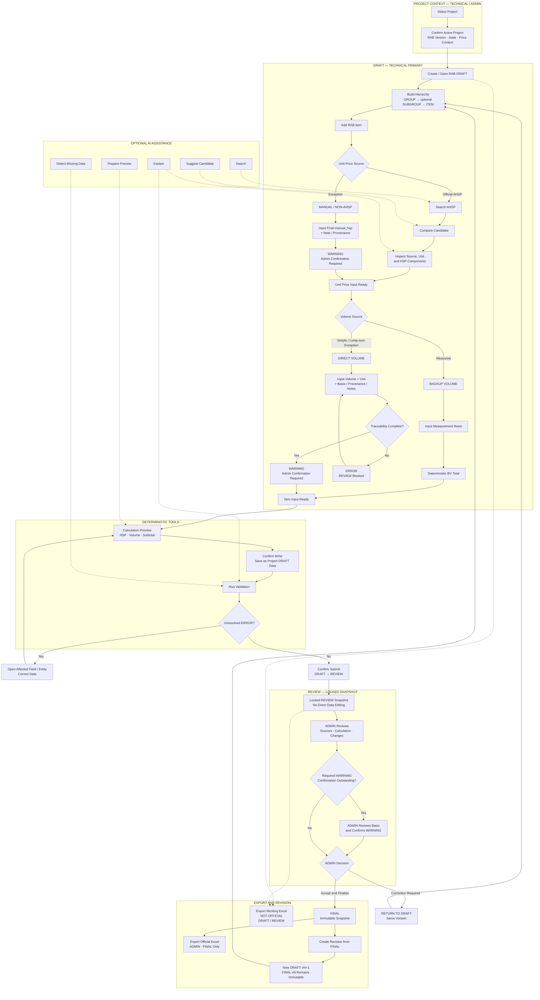

# Consultant AI Office — UX Structure Phase 0–1

## Document Status

| Field | Value |
|---|---|
| Scope | Phase 0 — AI Office Foundation; Phase 1 — RAB / Engineer's Estimate |
| Status | Ready for Implementation |
| Discipline | UX Structure, Information Architecture, Interaction Model |
| Excluded | Visual design final, coding, business-rule changes, Architecture Foundation changes, Phase 2–5 active features |
| Roles | TECHNICAL, ADMIN |

## 1. Purpose

Dokumen ini menetapkan struktur UX Consultant AI Office agar:

- project context selalu jelas;
- user tidak kehilangan posisi atau version;
- DRAFT, REVIEW, dan FINAL terlihat eksplisit;
- source data dan deterministic calculation dapat ditelusuri;
- ERROR dan WARNING mempunyai konsekuensi workflow yang jelas;
- read, preview, write, review, finalize, dan export tidak tercampur;
- human review tetap menjadi bagian workflow;
- AI berfungsi sebagai assistant/orchestrator, bukan source of truth;
- RAB/EE tetap dapat digunakan ketika AI disabled.

## 2. UX Principles

1. **Clarity** — project, version, state, dan action consequence harus terlihat.
2. **Traceability** — setiap volume, harga satuan, calculation, review, dan export dapat ditelusuri ke sumbernya.
3. **Low cognitive load** — structured workspace menjadi interaksi utama; chat hanya alat bantu.
4. **Progressive disclosure** — detail AHSP, HSP, BV, dan audit dibuka sesuai konteks.
5. **Reviewability** — REVIEW menggunakan locked snapshot.
6. **Recoverability** — kegagalan tidak boleh diam-diam menyimpan data; FINAL diubah melalui revision.

## 3. User Task Map

| Task | TECHNICAL | ADMIN | Expected result |
|---|---|---|---|
| Memilih dan melihat project | Ya | Ya | Active project terlihat permanen |
| Membuat dan mengedit technical DRAFT | Primary | Bila correction diperlukan | RAB DRAFT tersimpan dan traceable |
| Menyusun hierarchy RAB | Primary | Bila correction diperlukan | Group, optional subgroup, dan item valid |
| Input BV, volume, dan memilih AHSP | Primary | Review/correction | Input teknis mempunyai source |
| Memeriksa HSP dan calculation | Ya | Ya | Breakdown dapat diaudit |
| Submit DRAFT ke REVIEW | Ya | Ya | Locked REVIEW snapshot dibuat |
| Return REVIEW ke DRAFT | Tidak | Ya | Version yang sama kembali editable |
| Confirm required WARNING | Tidak | Ya | Confirmation tercatat |
| Finalize REVIEW | Tidak | Ya | FINAL immutable |
| Create revision from FINAL | Ya | Ya | DRAFT version baru dibuat |
| Working Excel Export | Ya | Ya | File bertanda NOT OFFICIAL |
| Official Excel Export | Tidak | Ya | File terikat FINAL snapshot |

UI visibility bukan security boundary. Authorization tetap tanggung jawab Application Layer.

## 4. Information Architecture

### 4.1 Global Navigation

```text
Projects | Review Queue | Data Sources | Activity
```

```text
CONSULTANT AI OFFICE
│
├── Projects
│   ├── Project Selection
│   └── Recent Projects
│
├── Review Queue
│   ├── Waiting for Review
│   └── Warning Confirmation Required
│
├── Data Sources
│   ├── AHSP
│   └── Base Prices
│
└── Activity
    ├── User Actions
    ├── Tool Executions
    └── Export History
```

AI Assistant bukan global destination. AI dibuka sebagai contextual side panel dari workspace terkait.

### 4.2 Project-Level Navigation

```text
[ACTIVE PROJECT HEADER]

Overview
RAB / EE
Project Activity
```

### 4.3 RAB Workspace Navigation

```text
RAB / EE
├── Estimate
├── Backup Volume
├── Price Context
├── Validation
├── Review & Export
└── Revisions
```

AHSP Search dan HSP Detail adalah contextual panel dari item RAB, bukan navigation level tambahan.

### 4.4 Persistent Context Header

Informasi berikut selalu terlihat:

```text
Project code · Project name · Location
RAB version · DRAFT/REVIEW/FINAL
Active Price Context
ERROR count · WARNING count
Last saved by · Last saved time
AI Enabled/Disabled
```

Pergantian project harus memperlihatkan project/version asal dan tujuan. Pending write harus diselesaikan atau dibatalkan sebelum context switch.

## 5. Workspace Inventory

| Workspace | Purpose | Primary user | Data shown | Primary actions | State |
|---|---|---|---|---|---|
| Project Selection | Menentukan active project | Both | Code, name, location, active RAB | Select/open | Semua |
| Project Overview | Memastikan project context | Both | Metadata dan current RAB | Open RAB | Semua |
| RAB Estimate | Menyusun hierarchy dan item | TECHNICAL | Group, subgroup, item, volume, HSP, subtotal | Add/edit/order | DRAFT |
| AHSP Search | Mencari analisa | TECHNICAL | Code, name, unit, source | Search/compare/select | DRAFT |
| HSP Detail | Audit unit-price calculation | Both | Components, coefficients, base price, totals | Inspect source | Semua |
| Backup Volume | Membentuk quantity terukur | TECHNICAL | Measurement rows dan result | Add/edit/preview | DRAFT |
| Direct Volume Entry | Exception input sederhana | TECHNICAL | Volume, unit, basis, notes | Preview/save | DRAFT |
| Manual/Non-AHSP Entry | Exception unit-price input | TECHNICAL | Manual HSP, note, provenance | Preview/save | DRAFT |
| Price Context | Menunjukkan price set aktif | Both | Context identity dan base prices | Inspect/change if allowed | DRAFT |
| Calculation Preview | Memisahkan calculated result dari saved data | TECHNICAL | Input, sources, HSP, volume, subtotal | Confirm/cancel | DRAFT |
| Validation | Menangani ERROR/WARNING | Both | Severity, reason, entity, consequence | Fix/jump/rerun | DRAFT/REVIEW |
| Review Queue | Menemukan submission | ADMIN | Project, version, submitter, warning count | Open review | REVIEW |
| Review Workspace | Human review | ADMIN | Locked snapshot, sources, changes | Return/confirm/finalize | REVIEW |
| Revision History | Menelusuri version lineage | Both | Versions, states, actions | Compare/create revision | Semua |
| Export Workspace | Working/official output | Both | State, version, export type | Preview/export | Semua |
| Activity History | Audit action dan tool | Both | Who, when, tool, outcome | Filter/inspect | Semua |
| AI Side Panel | Search/explain/suggest | Both | AI response dan source references | Ask/apply to preview | Semua |

## 6. Interaction Mode Contract

| Mode | Meaning | Save effect | Confirmation |
|---|---|---:|---|
| Read/Search | Membaca source atau project data | Tidak | Tidak |
| AI Suggestion | Candidate atau explanation | Tidak | Tidak |
| Deterministic Preview | Hasil engine dari input tertentu | Tidak | Tidak |
| Write | Mengubah saved project DRAFT data | Ya | Ya |
| Submit Review | Membuat locked REVIEW snapshot | Mengubah state | Ya |
| Warning Confirmation | Mencatat review terhadap exception | Audit/control event | ADMIN |
| Finalize | REVIEW menjadi immutable FINAL | Mengubah state | ADMIN |
| Export | Menghasilkan representation dari snapshot | Tidak mengubah source data | Sesuai jenis export |

## 7. Core User Flows



### 7.1 Select Project

```text
Projects
→ Select project
→ Display destination project/version/state
→ Confirm context switch when required
→ Pin active context in header
```

### 7.2 Create RAB and Hierarchy

```text
Project Overview
→ Create RAB Draft
→ Confirm project and initial price context
→ Add Group
→ Optionally add Subgroup
→ Add Item to exactly one Group or Subgroup
```

### 7.3 Official AHSP Item

```text
Add Item
→ Choose Official AHSP
→ Search and compare candidates
→ Inspect code/source/unit/HSP components
→ Select AHSP
→ Select volume source
→ Deterministic calculation preview
→ Confirm write
```

### 7.4 Resolve Missing Price

```text
Missing price detected
→ ERROR on affected HSP component
→ Open corresponding base-price source
→ Correct through valid application flow
→ Recalculate
→ Rerun validation
```

### 7.5 Submit, Review, and Finalize

```text
DRAFT
→ Full validation
→ Resolve all ERROR
→ Confirm Submit to Review
→ Locked REVIEW snapshot
→ ADMIN reviews sources/calculation/WARNING
→ Return to DRAFT on same version
   or
→ Confirm required WARNING and finalize
→ Immutable FINAL
```

### 7.6 Revision

```text
FINAL vN
→ Create Revision
→ Confirm source snapshot
→ DRAFT vN+1
→ FINAL vN remains immutable
```

## 8. State Model

### 8.1 Lifecycle

```text
DRAFT → REVIEW → FINAL
```

Approval dan confirmation adalah execution/control events, bukan document state.

| State | Presentation | Editable | Primary actions | Protection |
|---|---|---:|---|---|
| DRAFT | Version, validation counts, last saved | Ya | Edit, calculate, validate, working export, submit | Write preview and confirmation |
| REVIEW | Submitted by/time, locked snapshot | Tidak | Inspect, comment, confirm warnings, return, finalize, working export | No direct data mutation |
| FINAL | Finalized by/time, immutable indicator | Tidak | Read, official export, create revision | Changes require new revision |

State tidak hanya dibedakan oleh warna. Text label, lock/edit state, version, audit metadata, dan available actions wajib konsisten.

### 8.2 REVIEW → DRAFT

- Menggunakan action `RETURN TO DRAFT`.
- Tetap pada version/revision yang sama.
- REVIEW snapshot, review comments, dan return event tetap terlihat dalam audit history.
- Revision baru hanya digunakan untuk mengubah FINAL.

## 9. Role/Action UX

| Action | TECHNICAL UX | ADMIN UX |
|---|---|---|
| Edit technical DRAFT | Primary controls | Available for correction |
| Submit REVIEW | Available | Available |
| Return to DRAFT | Not available | Available in REVIEW |
| Confirm WARNING | Read-only status | Confirmation controls |
| Finalize | “Requires Admin” information | Available after requirements satisfied |
| Create revision | Available | Available |
| Working export | Available | Available |
| Official export | “Available to Admin on FINAL” | Available only on FINAL |

## 10. RAB Hierarchy UX

Supported structure:

```text
GROUP
├── ITEM
├── ITEM
└── SUBGROUP
    ├── ITEM
    └── ITEM
```

Rules represented by UX:

- Group wajib.
- Subgroup opsional.
- Maksimum satu level Subgroup.
- Tidak ada nested Subgroup.
- Item berada tepat pada satu Group atau Subgroup.
- Group, Subgroup, dan Item dapat diurutkan.
- Stable semantic ID tidak berubah akibat reorder.
- Subgroup subtotal adalah jumlah child items.
- Group subtotal mencakup direct group items dan subgroup children.
- Rekap utama berbasis Group.

## 11. Direct Volume UX

Direct Volume adalah exception path untuk quantity sederhana, lump-sum, atau kondisi ketika BV geometris tidak diperlukan secara wajar.

```text
VOLUME SOURCE
( ) Backup Volume — measured breakdown
( ) Direct Volume — exception requiring basis and review
```

Direct Volume UI menampilkan:

```text
Volume
Unit
Basis/provenance
Supporting notes
Validation status
Reviewer confirmation status
```

Behavior:

- `volume = 0`: DRAFT dapat disimpan sebagai incomplete + ERROR.
- Direct Volume tanpa traceability: ERROR dan REVIEW blocked.
- Direct Volume traceable: WARNING.
- ADMIN confirmation diperlukan sebelum FINAL.
- REVIEW dan FINAL mewajibkan volume `> 0`.

## 12. MANUAL/NON-AHSP UX

```text
UNIT PRICE SOURCE
( ) Official AHSP
( ) MANUAL / NON-AHSP — exception
```

UI exception menampilkan:

```text
Final Unit Price: manual_hsp
Basis/source
Notes
Validation status
Reviewer confirmation status
```

Rules represented by UX:

- `manual_hsp` adalah final unit price.
- Tidak dibuat fake AHSP component breakdown.
- Tidak ditambahkan OH/profit kedua kali.
- `manual_hsp = 0`: DRAFT incomplete + ERROR.
- REVIEW dan FINAL mewajibkan `manual_hsp > 0`.
- Valid MANUAL/NON-AHSP menghasilkan WARNING.
- ADMIN confirmation diperlukan sebelum FINAL.

## 13. Validation UX

Business severities:

- ERROR
- WARNING

Presentation-only feedback:

- INFO
- SUCCESS

Setiap finding menampilkan:

```text
Severity
Reason
Affected field/entity
Workflow consequence
Required action
```

| Severity | DRAFT save | DRAFT → REVIEW | FINAL |
|---|---|---|---|
| ERROR | Bisa jika incomplete state sah | Blocked | Tidak boleh unresolved |
| WARNING | Allowed | Allowed | Required confirmation harus selesai |
| INFO | No effect | No effect | No effect |
| SUCCESS | No effect | No effect | No effect |

UX tidak boleh menggunakan warna sebagai satu-satunya pembeda severity.

Tool execution failure ditampilkan terpisah dari business validation:

```text
TOOL EXECUTION FAILED
No project data was saved.
Tool · Run ID · Input retained
[Retry] [Review Input] [Technical Details]
```

## 14. Price Context UX

RAB header menampilkan:

```text
ACTIVE PRICE CONTEXT
Identity/label from application
Used by RAB version/state
```

Behavior:

- AHSP definition dan base price ditampilkan sebagai sumber terpisah.
- DRAFT dapat mengganti Price Context melalui valid application flow.
- REVIEW menggunakan locked Price Context snapshot.
- FINAL tidak mempunyai action mengganti Price Context.
- Perubahan setelah FINAL membutuhkan revision.

Phase 1 UX tidak membuat stale-price rule, expiry rule, vendor freshness score, automatic location/year switching, atau multi-price-set policy baru.

## 15. Excel Export UX

| Attribute | Working Export | Official Export |
|---|---|---|
| Action | Export Working Excel | Export Official Excel |
| State | DRAFT, REVIEW | FINAL only |
| Role | TECHNICAL, ADMIN | ADMIN only |
| Marker | NOT OFFICIAL | Official artifact |
| Metadata | Project, version, status | Project, FINAL version/snapshot |
| History | Recorded | Recorded and immutable |
| Overwrite | Tidak menyamarkan versi lama | Tidak destructive overwrite |

Working dan Official Export tidak digabungkan menjadi satu tombol `Export` dengan behavior tersembunyi.

## 16. AI Interaction Model

| Layer | UX label | Meaning |
|---|---|---|
| AI | `AI SUGGESTION — NOT SAVED` | Candidate atau explanation |
| Tool | `DETERMINISTIC PREVIEW` | Reproducible calculated result |
| Database | `SAVED PROJECT DATA` | Project source of truth |

AI dapat:

- search;
- suggest candidate;
- explain;
- detect missing data;
- summarize;
- prepare preview.

AI tidak dapat:

- menebak harga atau volume;
- mengubah deterministic result;
- menyimpan tanpa confirmation;
- bypass validation atau authorization;
- confirm required WARNING;
- return REVIEW;
- finalize.

Seluruh RAB workflow tetap tersedia melalui structured workspace ketika AI disabled.

## 17. Low-Fidelity Wireframes

### 17.1 Main RAB Workspace

```text
+------------------------------------------------------------------+
| P-024 · Project Name · Location | RAB v2 | DRAFT                 |
| Active Price Context: PC-01     | 2 ERROR · 1 WARNING            |
+--------------+------------------------------------+--------------+
| Overview     | ESTIMATE                           | AI Assistant |
| RAB / EE     |                                    | P-024 / v2   |
| Activity     | GROUP A                            |              |
|              | ├ ITEM 1                           | Suggestions  |
| Estimate     | └ SUBGROUP A.1                     | NOT SAVED    |
| Backup Vol.  |   ├ ITEM 2                         |              |
| Price Context|   └ ITEM 3                         | [Ask...]     |
| Validation   |                                    |              |
| Review/Export| [+ Group] [+ Subgroup] [+ Item]    |              |
| Revisions    |                                    |              |
+--------------+------------------------------------+--------------+
```

### 17.2 Volume Source

```text
+--------------------------------------------------------------+
| Item PRE-003 — Volume                                        |
+--------------------------------------------------------------+
| VOLUME SOURCE                                                |
| (•) Backup Volume                                            |
| ( ) Direct Volume — exception requiring review               |
|                                                              |
| [Measurement rows / Direct-volume fields]                    |
|                                                              |
| Result: 74.3535 m³                                           |
| Source status: TRACEABLE                                     |
| [Cancel] [Preview Changes]                                   |
+--------------------------------------------------------------+
```

### 17.3 Review Workspace

```text
+--------------------------------------------------------------+
| Project · RAB v2 · REVIEW · LOCKED                           |
| Submitted by Technical · timestamp                           |
+--------------------------------------------------------------+
| Validation: 0 ERROR · 2 WARNING                              |
|                                                              |
| Required confirmations                                       |
| [ ] Direct Volume — PRE-003     [Review basis]               |
| [ ] Manual/Non-AHSP — STR-014   [Review provenance]          |
|                                                              |
| Comments [...]                                               |
+--------------------------------------------------------------+
| [Return to Draft]                         [Finalize]          |
+--------------------------------------------------------------+
```

## 18. UX Risk Register

| Risk | Failure | Mitigation |
|---|---|---|
| Wrong project | User menulis pada project lain | Persistent project header dan switch confirmation |
| Wrong version | FINAL dianggap editable | State/version pada header, preview, dan export |
| Accidental write | Preview dianggap tersimpan | Explicit NOT SAVED dan confirm-write step |
| Accidental finalize | Finalize dianggap save biasa | Dedicated finalization preview dan ADMIN authorization |
| Direct-volume misuse | Angka dimasukkan tanpa basis | Mandatory provenance dan validation consequence |
| Manual-HSP misuse | Manual price disamarkan sebagai AHSP | Exception label dan tidak ada fake breakdown |
| Double OH/profit | Manual HSP mendapat markup kedua | Tampilkan manual_hsp sebagai final unit price |
| Warning bypass | Reviewer melewatkan exception | Required-confirmation queue sebelum FINAL |
| Calculation overtrust | Total tampil tanpa input trace | HSP dan BV trace panels |
| AI overtrust | AI candidate dianggap authoritative | `AI SUGGESTION — NOT SAVED` |
| Hidden failure | Tool gagal tetapi user mengira berhasil | Persistent failure dan `No data saved` |
| Official-export misuse | DRAFT diedarkan sebagai official | NOT OFFICIAL marker dan separate export actions |
| Destructive overwrite | Official artifact lama hilang | Immutable export history |
| Arbitrary hierarchy | User membuat nested tree tidak terbatas | Fixed one-level Subgroup structure |

## 19. UX Handoff

### BUILD NOW

- Project selection dan persistent context header.
- Global dan project navigation.
- Structured RAB Estimate workspace.
- Fixed Group/Subgroup/Item hierarchy.
- AHSP search dan HSP component inspection.
- Backup Volume workflow.
- Direct Volume exception workflow.
- MANUAL/NON-AHSP exception workflow.
- Active Price Context display.
- Deterministic calculation preview.
- Explicit write confirmation.
- ERROR/WARNING validation workspace.
- REVIEW locking dan Review Queue.
- ADMIN required-WARNING confirmation.
- Return to DRAFT pada version yang sama.
- Immutable FINAL.
- Revision from FINAL.
- Working dan Official Excel Export separation.
- Activity, execution, dan export history.
- Optional AI side panel.
- Full structured workflow ketika AI disabled.

### DESIGN FOR LATER

Hanya siapkan extension points, bukan fitur aktif:

- additional deterministic-tool renderers;
- additional validation finding types;
- additional output renderers setelah canonical approval;
- dependency indicators untuk future modules;
- more granular permission presentation jika role berkembang secara canonical.

### DO NOT BUILD YET

- RKS;
- Document Engine;
- Project Control;
- Phase 2–5 navigation;
- multi-agent dan specialist agents;
- autonomous routing, finalization, atau sending;
- CAD/GIS generation;
- stale-price atau price-expiry policy;
- arbitrary-depth RAB hierarchy;
- chat-only RAB workflow;
- fake AHSP untuk manual item;
- formula atau workbook business contract baru.

## 20. Final Verdict

> **UX STRUCTURE READY FOR IMPLEMENTATION**

UX decision gate telah ditutup. Struktur ini dapat digunakan sebagai implementation handoff tanpa mengubah Domain Model, formula, Architecture Foundation, atau contract Jalur A/B/C.
