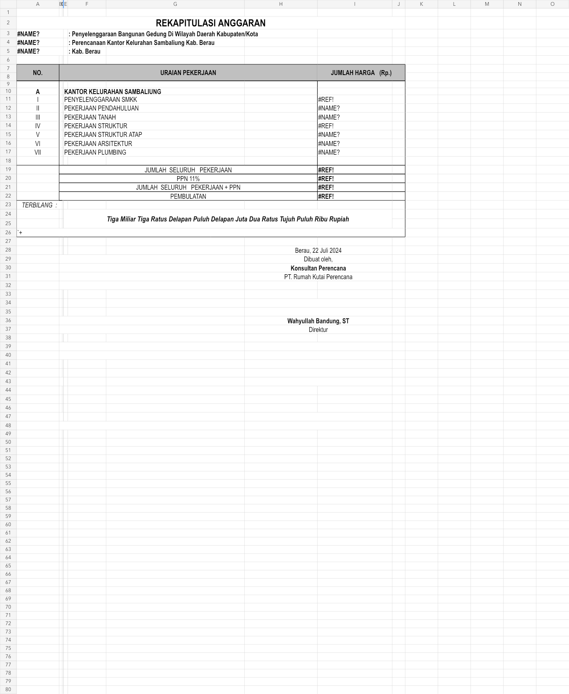
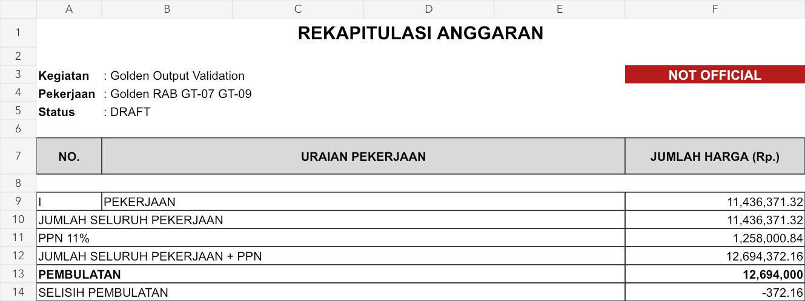
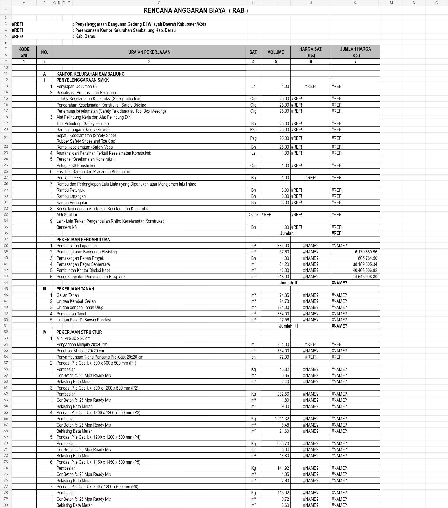
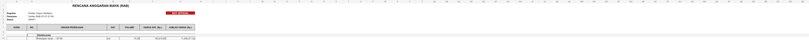
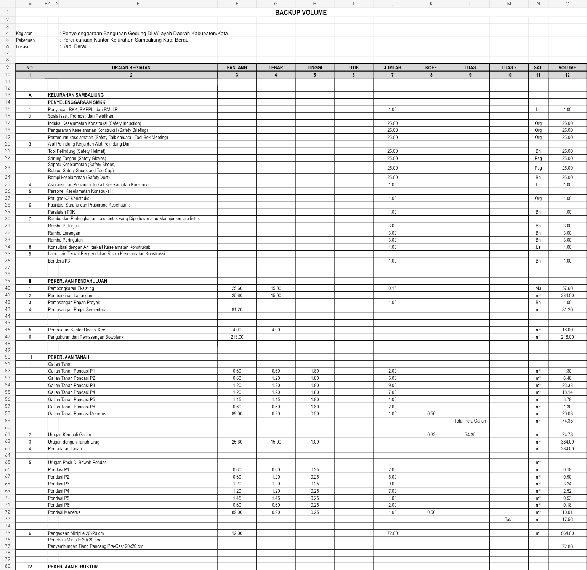
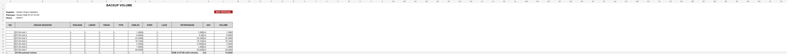

# Phase 1A Visual Parity Review — GT-07 / GT-09

Status: **TECHNICAL VALIDATION EVIDENCE — NOT OFFICIAL**

Reference: `references/raw/Contoh Rekap RAB dan BV.xlsx` and the source-backed GT-07/GT-09 fixtures. Candidate: `GT-07-GT-09-working.xlsx`.

## Side-by-side inspection

| Sheet | Approved source | Phase 1A candidate |
|---|---|---|
| REKAP |  |  |
| RAB |  |  |
| BV |  |  |

## Parity result

| Review point | Result | Evidence |
|---|---|---|
| Sheet reading order | PASS | Candidate opens with `REKAP → RAB → BV`, matching the source working-document sequence. |
| Heading hierarchy | PASS | Title, project context, status, grey table heading, and bordered calculation area follow the source visual language. |
| REKAP structure | PASS | Group summary, subtotal, PPN, amount before rounding, rounding, and rounding difference are presented in the same reading order. |
| RAB structure | PASS | Civil-review columns are limited to code, number, work description, unit, volume, unit price, and amount. |
| BV structure | PASS | Activity description, civil dimension columns, unit, calculation note, and volume remain visible and auditable. |
| Number presentation | PASS | Volumes, coefficients, prices, amounts, PPN, and final thousand rounding use explicit numeric formats without changing stored precision. |
| Working-output status | PASS | `NOT OFFICIAL` is visible on every user-facing sheet. |
| Formula rendering | PASS | No visible `#REF!`, `#DIV/0!`, `#VALUE!`, `#NAME?`, or `#N/A`. |
| Technical-ID privacy | PASS | No project, RAB, snapshot, item, HSP, component, resource, BV-line, parent, or reference IDs appear on the five visible sheets. |
| Traceability retention | PASS | IDs and provenance remain in protected `veryHidden` sheets: `PROJECT`, `AHSP_COMPONENTS`, `HSP_MAPPING`, and `CHECKS`. |

## Intentional deviations from source

1. `ANALISA HSP` and `HARGA DASAR` are included as additional visible review sheets so the workbook is self-contained; the legacy source depended on separate/external AHSP workbooks.
2. External links, data connections, macros/VBA, and stale cached formulas are absent.
3. Source `#REF!/#NAME?` errors are not reproduced. Candidate formulas use internal workbook references and deterministic cached values from the calculation snapshot.
4. Final rounding uses authoritative HALF_UP Rp1.000, not the legacy always-up formula.
5. Raw technical IDs are moved from the civil-review surface to protected `veryHidden` metadata.
6. The GT-09 fixture provides child volumes but not source dimension operands; unavailable BV dimension cells are shown as an en dash rather than fabricated geometry.
7. Signature and terbilang blocks from the legacy project example are not asserted as Golden Phase 1A calculation evidence.

No deviation changes the calculation contract or introduces a new business rule.
